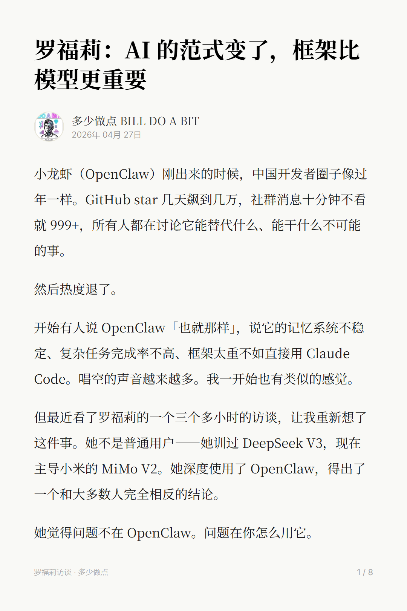
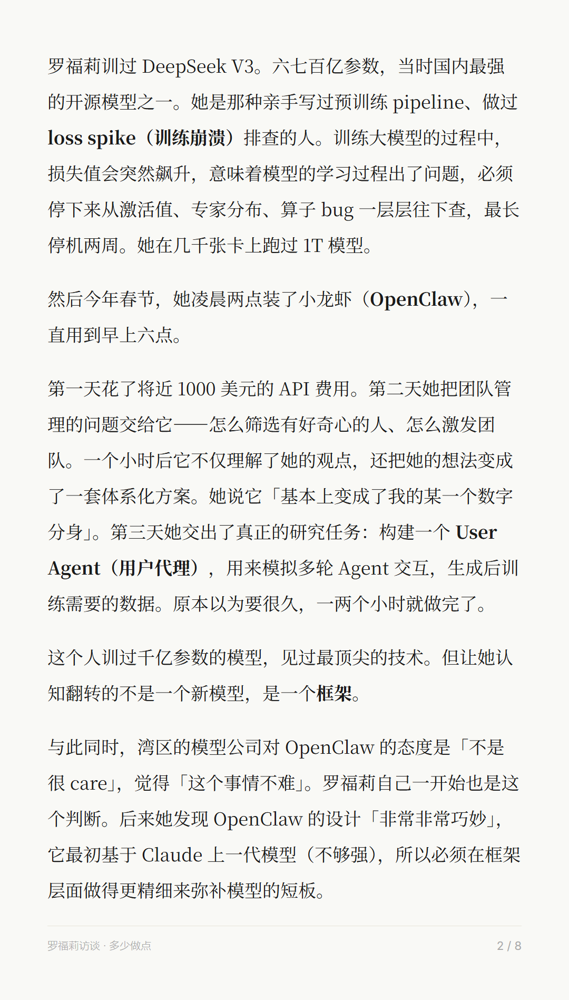
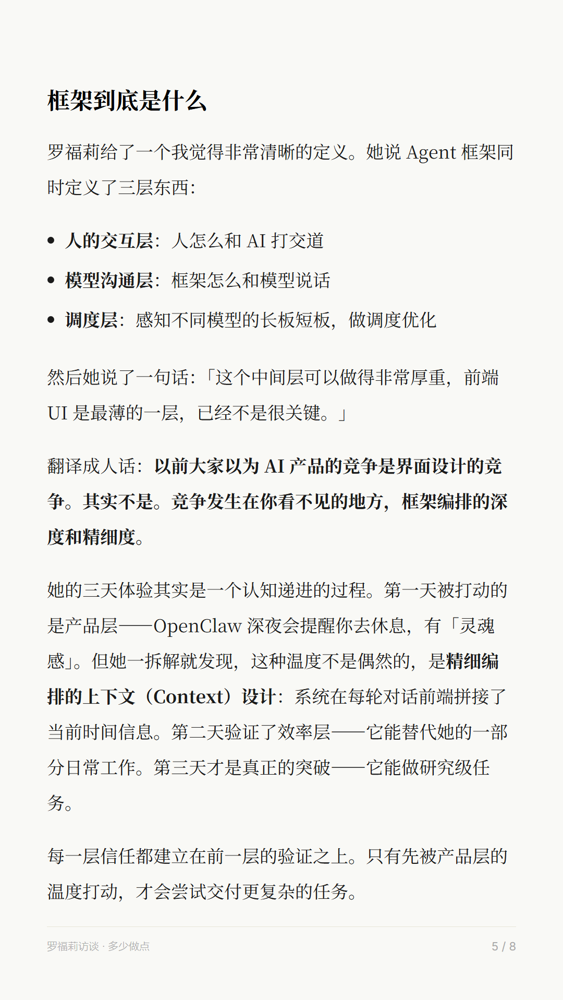

# 📸 MD Poster

**把 Markdown 转成精美文字图片。Turn Markdown into beautiful text images.**

3 步，30 秒，一篇文章变成 8 张精美图文海报。已用于 **23+ 篇正式文章**的生产。

[效果展示](#效果展示) · [快速开始](#-快速开始) · [使用方法](#-使用方法) · [设计系统](#-设计系统) · [关于作者](#-关于作者)

---

## 效果展示

> 以下是使用本工具生成的真实文章卡片（非 P 图，非手动排版）：

<p align="center">
  
  
</p>
<p align="center">
  
</p>

**这些卡片是怎么生成的？**

```
Markdown 正文 → Python 脚本 → HTML + CSS → Playwright 截图 → PNG 图片
```

整个过程不到 30 秒。不需要打开任何设计工具。

---

## 30 秒看懂

| 对比 | 手动工具 (Canvas/PS) | MD Poster |
|------|---------------------|-------------------|
| **一致性** | 每次手动调，容易走形 | CSS 锁死，永远一致 |
| **效率** | 8 页 ≈ 2 小时 | 8 页 ≈ 30 秒 |
| **可维护** | 改风格要重做所有图 | 改 CSS 一行，全部更新 |
| **AI 友好** | AI 帮不了你拖拽 | AI 天生擅长写代码 |

---

## 🚀 快速开始

### 1. 安装依赖

```bash
# 方法一：一键安装
bash scripts/setup.sh

# 方法二：手动安装
pip install playwright
playwright install chromium
```

### 2. 生成 HTML

```bash
cd examples/basic
python xhs_pages.py
```

这会读取 `example_article.md`，生成 `example_xhs_pages.html`（4 页卡片）。

### 3. 截图

```bash
python ../../scripts/screenshot.py --auto-height
```

打开 `output/` 文件夹，你的图文卡片就在那里 🎉

---

## 📁 仓库结构

```
md-poster/
├── README.md                        # 你正在看的这个
├── SKILL.md                         # AI 使用手册（教 AI 怎么用这套系统）
├── LICENSE                          # MIT 开源协议
├── assets/
│   └── demo-output/                 # 效果展示截图
├── scripts/
│   ├── screenshot.py                # 通用截图脚本
│   └── setup.sh                     # 一键安装
├── templates/
│   └── xhs_card_template.html       # 卡片 HTML 模板（可直接编辑）
├── examples/
│   ├── basic/                       # 基础示例（可直接跑）
│   │   ├── example_article.md
│   │   └── xhs_pages.py
│   └── real-output/                 # 真实产出样品
└── docs/
    ├── design-system.md             # CSS 设计系统详解
    ├── methodology.md               # 为什么 HTML > Canvas
    └── troubleshooting.md           # 踩坑记录
```

---

## 🎨 设计系统

默认视觉风格：**米白底 + 思源宋体 + 1080px 宽**

| 参数 | 值 |
|------|------|
| 卡片宽度 | 1080px（小红书原生分辨率） |
| 背景色 | `#F9F9F6`（米白色） |
| 正文字体 | Noto Serif SC（思源宋体） |
| 正文字号 | 34px，行高 2.0 |
| 标题字号 | H1: 56px, H2: 44px |
| 内边距 | 90px |

想自定义？→ [CSS 设计系统文档](docs/design-system.md)

---

## 📝 使用方法

### 方法一：修改示例脚本（推荐）

1. 复制 `examples/basic/xhs_pages.py` 到你的文章目录
2. 修改顶部的 Config 区：

```python
SRC = Path(__file__).parent / "你的文章.md"
TITLE = "你的文章标题"
AUTHOR = "你的名字"
TOTAL_PAGES = 6

# 分页定义：每个元组是 (起始行, 结束行)
PAGES = [
    (1, 15),    # 第1页
    (17, 30),   # 第2页
    # ...
]
```

3. 运行 `python xhs_pages.py` 生成 HTML
4. 把 `scripts/screenshot.py` 复制过来，运行截图

### 方法二：直接编辑 HTML 模板

1. 打开 `templates/xhs_card_template.html`
2. 搜索 `{{PLACEHOLDER}}` 并替换为你的内容
3. 复制 `<div class="card">` 块来增加页数
4. 运行 `scripts/screenshot.py` 截图

### 方法三：让 AI 帮你生成（最省力）

把你的 Markdown 文章和 `SKILL.md` 一起发给 AI（ChatGPT / Claude / Gemini），说：

> "根据这个 SKILL.md 的规范，帮我把这篇文章排版成小红书图文。生成一个 xhs_pages.py 脚本。"

AI 会帮你生成完整的排版脚本，你只需要运行它。

---

## 📐 分页规则

| 规则 | 值 |
|------|------|
| 每页目标字数 | 700-800 字 |
| 每页目标高度 | ~2000px |
| 最大页数 | 8 页正文（小红书上限 9 张 = 1 封面 + 8 正文） |
| 分页位置 | 在自然断点处（段落间、章节标题前） |

---

## ⚠️ 常见问题

| 问题 | 解决方案 |
|------|---------|
| 截图有蓝色边框 | 使用 headless 模式（默认）；JS 清理脚本已内置 |
| 字体没加载完 | 第一页等 3 秒（脚本已处理） |
| 超过 8 页 | 增大每页字数，不要删内容 |
| 中文 HTML 被截断 | 让 AI 写 Python 脚本而非直接输出 HTML |

更多 → [troubleshooting.md](docs/troubleshooting.md)

---

## 背后的故事

这套系统是从手动 P 图的痛苦中长出来的。

最初，我每篇文章要花 2 个小时在 Canvas 里调排版。8 页卡片，每页都要手动对齐文字、调字号、拖文本框。写完 3000 字的文章，排版时间比写作时间还长。

后来我想到：排版的本质就是「按照固定规则把文字渲染成图片」——这不就是浏览器天天在做的事吗？

于是我用 HTML + CSS 写了一套排版模板，用 Playwright 截图。第一次跑通的时候，8 张卡片 30 秒就出来了，质量比我手动排的还好。

现在这套系统已经迭代了 **23+ 篇文章**，从字体选择到分页策略到截图脚本，每个细节都是真实生产中打磨出来的。

今天把它开源了。如果你也在做小红书图文，试试这个方案。

想了解更多技术细节？→ [为什么 HTML > Canvas](docs/methodology.md)

---

## 🙋 关于作者

**Do A Bit 多少做点** — AI-augmented content creator

这套系统是我用 AI Agent 辅助内容创作的一部分。从选题到写作到排版到分发，整个流程都有 AI 参与。排版只是其中一个环节。

- 🐦 X (Twitter): [@Bill_Do_A_Bit](https://x.com/Bill_Do_A_Bit)
- 📕 小红书: **Do A Bit 多少做点**
- 💬 Signal: Billdoabit
- 📧 Email: bill.jjxu@gmail.com
- 💚 微信: 扫码添加 ↓

<p align="center">
  
</p>

如果你觉得有用，欢迎 ⭐ Star 这个仓库。有问题？开 Issue 或者来小红书找我聊。

---

## 📄 开源协议

MIT License — 随便用，随便改，注明出处即可。

> 手动排版让你花时间在操作上。
> 代码排版让你花时间在内容上。
> 你的时间应该花在写作，不是拖拽。

MIT License © [Do A Bit 多少做点](https://github.com/BeardJohnJohn)

---

*Made with ❤️ and 23+ articles of iteration*
